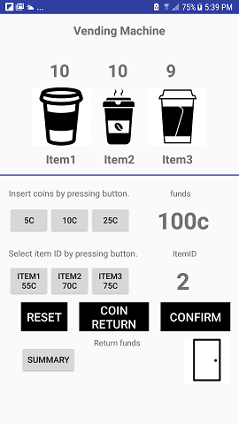
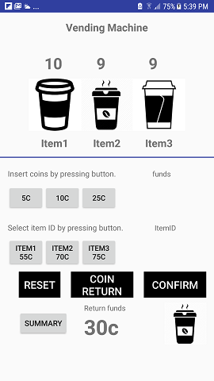
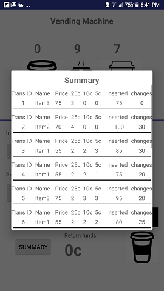
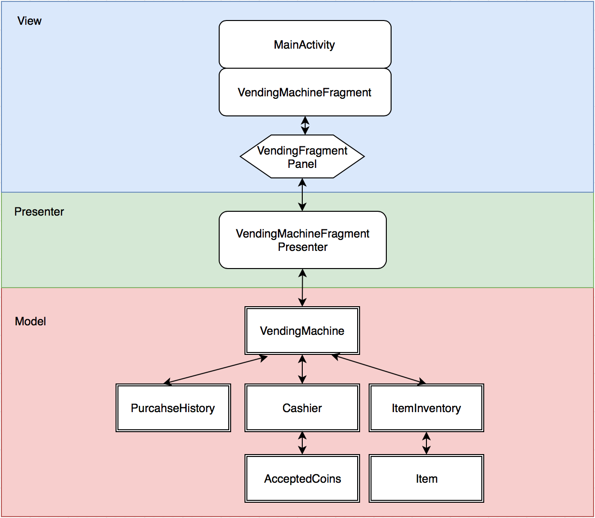

# My-Vending-Machine

Design and code a vending machine that satisfies the following diagram. But also take considerations for additional features that may come in the future. We are looking for software developers that not only satisfy the requirements at hand but also plan for changes in the future. 

## Screen shots
### After inseted 100c and selected item 2


### After confirmed purcahse. You can see the changes returned on the bottom and the selected item was delivered.


### Transaction summary


## Achitecture

### MVP pattern. 

### Model layer
All business logic are wrapped in bellow pojo Java model classes:
#### Class VendingMachine
```
VendingMachine - provides all APIs to access VandingMachine from presenter layer.
1. resetMachine - Reset Vending machine to start state
2. insertCoin - inserts coin into slot and returns running amount 
3. KeyInId - Validate itemID that user selected.
4. confirmSelection - Confirm selection and process purchasing
5. abortPurchasing - Aborts purchasing and returns coind in slot
6. getInventory - returns inventory info for all items
7. getPurchaseHistory - returns all transactions. It can be used for summary reporting

Here is the interface which defines all methods:

public interface IVendingMachine {
    void setInventoryListener(VendingMachine.InventorListener listener);
    void resetMachine();
    int insertCoin(AcceptedCoins coin);
    boolean keyInId(String itemId);
     /**
     * Confirm selection and move forward purchasing
     * @return int as changes will be returning to user
     * @throws NoSufficientFundsException if there is not sufficient funds been received
     * @throws NoEnoughItemsException  if the selected item has been sold out.
     */
    int confirmSelection() throws NoSufficientFundsException, NoEnoughItemsException;
    int abortPurchasing();
    List<ItemInventory> getInventory();
    boolean isItemSelected();
    List<PurchaseHistory> getPurchaseHistory();
    }

```
#### Class Cashier

```
addCoinInToSlot(AcceptedCoins coin) - Simulate the process that the user insert coin into slot.
confirmPurchasingAndReturnChanges(int itemPrice) - Process purcahse once get confirmed.
getCoinsInSlot() - Returns coins summary in slot.
resetCashier() - Constructor calls it to reset Cashier to start state.
returnCoinsInSlot() - It will be called when user abort purchasing or there is no sufficient funds insterted.

Here is the interface:
public interface ICashier {
    int addCoinInToSlot(AcceptedCoins coin);
    int confirmPurchasingAndReturnChanges(int itemPrice);
    int returnCoinsInSlot();
    void resetCashier();
    Map<AcceptedCoins, Integer> getCoinsInSlot();
}

```
#### enum AcceptedCoins

```
/**
 * Definwes all acceptable coin types and their unique keys
 * NICKELS - nickels
 * DIMES - dimes
 * QUARTER - quarter
 */
public enum  AcceptedCoins {

    NICKELS (5),
    DIMES (10),
    QUARTERS (25);
...
}
```

#### class Item
```
/**
 * This class represents a item in vending machine
 */
public class Item {

    private final String id;
    private final String itemName;
    private final int price;

    /**
     * Parameterized constructor.
     * @param id: product unique ID.
     * @param itemName: product name
     * @param price: sale price in penny
     */
 
...

```

#### class ItemInventory

```
/**
 * Inventor info for a single item
 * 1. Item {@link Item}
 * 2. quantity
 */
public class ItemInventory {
    private Item item;
    private int quantity;
    
...
```

#### class PurchaseHistory

```
/**
 * Summary all transactions. It logs:
 * 1. purcahseId - unique ID for each transaction
 * 2. itemName
 * 3. itemPrice
 * 4. Inserted Nickels number
 * 5. Inserted Dimes number
 * 6. Inserted Quarters number
 * 7. Total inserted
 * 8. Changes returned
 */
public class PurchaseHistory {
    private  int purcahseId;
    private String itemName;
    private int itemPrice;
    private int nickel;
    private int dime;
    private int quarter;
    private int totalInsert;
    private int changes;
    
....
```
### Presenter layer

#### class VendingMachineFragPresenter
```
The presenter is responsible to act as the middle man between view and model. It retrieves data from the model and 
returns it formatted to the view.

It holds instance of VendingMachine
 public VendingMachineFragPresenter() {
        mVendingMachine = new VendingMachine();
        mVendingMachine.setInventoryListener(this);
    }

getInventory() - Retrieve Inventory info from VendingMachine and then call panel to render the view.
insertCoin(AcceptedCoins coin) - Count coins in slot while the user inserts them. Update view with the running amount.
selectItemId(String itemId) - Call VendingMachine to validate the keyin itemId and send to view if it's valid.
abortPurchasing() - Call this when the user abort purchasing. The inserted coins will be returned.
confirmPurchasing() - Call this if user confirmed the purchasing and then process the purchasing through VendingMachine
    Here are two exception might be caught:
     * 1. {@link NoSufficientFundsException} there is no sufficient funds.
     * 2. {@link NoEnoughItemsException} the selected item has been sold out.
getHistories() - get history transaction when the user press Summary button.
onInventoryChanged(ItemInventory itemInventory) - Implements {@linkInventorListener} Whenever the inventory info were updated. Call panel to update new number into view layer.
```
### View layer

#### interface VendingMachineFragPanel
```
/**
 * Abstract view layer methods. Presenter uses panel to access view.
 * {@link com.example.wkuai.myvendingmachine.views.VendingMachineFragment} implements it.
 */
public interface VendingMachineFragPanel {

    /**
     * Update inventory info to the viewlayer
     * @param itemId
     * @param count
     */
    void renderItemInventory(String itemId, int count);

    /**
     * Reset view when purchase is finished
     */
    void clearViews();

    /**
     * Update funds info while the user is inserting coins into slot
     * @param funds
     */
    void updateAvailableFundsView(int funds);

    /**
     * Upadate item selection view when the user selects items
     * @param itemId
     */
    void updateItemSelectView(String itemId);

    /**
     * Update funds return view when the machine returns changes or the purchasing been aborted.
     * @param funds
     */
    void updateReturnFundsView(int funds);

    /**
     * Toast alert in two cases:
     * 1. No sufficient funds. The inserted coins will be returned
     * 2. The selected item was sold out. The inserted coins will be returned
     * @param msg
     */
    void displayAlert(String msg);

    /**
     * Display an item image indicates teh selected item was delivered successfully.
     * @param itemId
     */
    void kickOutItem(String itemId);
}
```
#### class VendingMachineFragment
```
- It holds all view parts of our VendingMachine. 
- It provides UI to simulate a Vending machine. 
- User can press buttons to keyin itemId or insert coins.
- It displays all available items and their prices and inventory info.
- Also it displays funds info is the user inserts coins.
- Once purchase is finished or aborted. It delivers item or return funds.

It's the class to implements VendingMachinePanel.
```

#### class SummaryAdapter
```
Summary ListView uses this adapter to display history transaction by below fields:

 * - Purchase ID
 * - Item Name
 * - Item Price
 * - Quarter count
 * - Dime count
 * - Nickel count
 * - Total insert
 * - Changes


```


